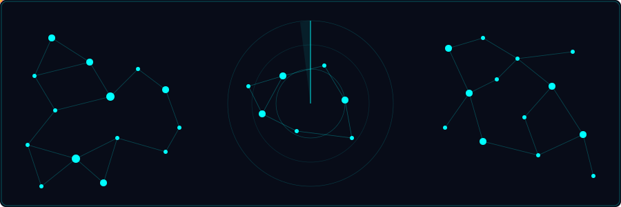
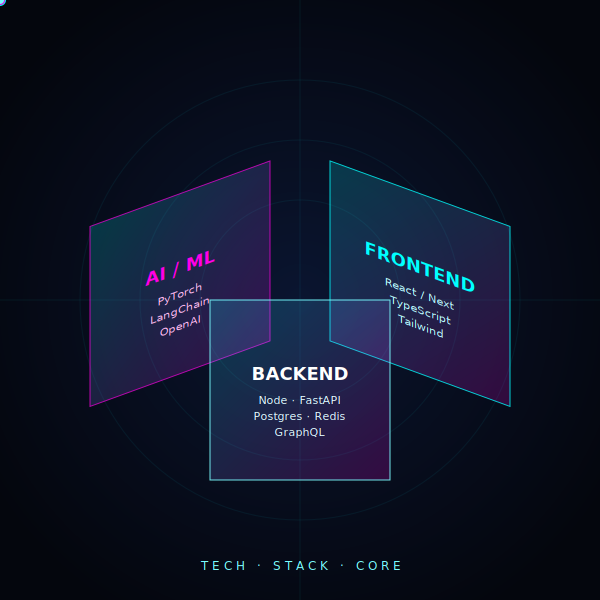

  

  

 

&nbsp;&nbsp;&nbsp;&nbsp;

<!-- ======== NEURAL NETWORK PULSE ======== -->

  

<!-- ======== SYSTEM PROFILE ======== -->

  

<!-- ======== TECH ARSENAL ======== -->

  

<!-- ======== AviralGPT AI CORE ======== -->

  

<!-- ======== MISSION CONTROL ======== -->

  

<!-- ======== GITHUB STATS (custom SVG - never breaks) ======== -->

  

<!-- ======== CONNECT ======== -->

*"Ship fast. Learn faster. Build things that matter."*

**&#x2014; Open to full-stack & AI collaboration &#x1F91D; Let's build something epic together**

  

