  

 

  
    
  

 

  

<!-- ═══════ NEURAL NETWORK ═══════ -->

  

<!-- ═══════ TECH STACK ═══════ -->

  

<!-- ═══════ ACHIEVEMENTS ═══════ -->

  

<!-- ═══════ GITHUB STATS ═══════ -->

  

<!-- ═══════ CONNECT ═══════ -->

  

<!-- ═══════ FOOTER ═══════ -->

  

